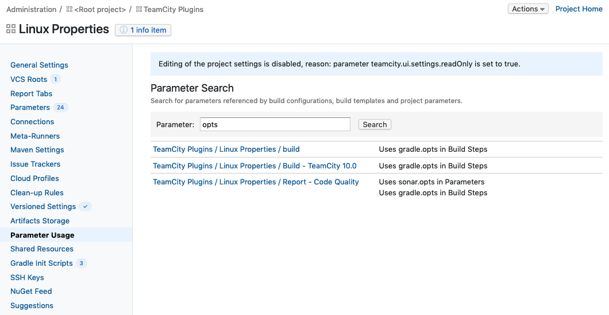

= TeamCity Usage Search plugin
:uri-teamcity: https://www.jetbrains.com/teamcity/[TeamCity]
:uri-jetbrains-plugin: https://plugins.jetbrains.com/plugin/12596-usage-search
:uri-issue: https://youtrack.jetbrains.com/issue/TW-18543[TW-18543]
:uri-gradle: https://gradle.org/[Gradle]

A {uri-teamcity} plugin that provides support for searching build configurations, build templates and projects that
reference  a configuration parameter.
Search supports partial parameter name searches and can be limited to a project and its sub-projects.

== Using the plugin

* Navigate to a project in the Administration page and select the `Parameter Usage` page.

* Enter a parameter name or part of a name and click the search button. A list of build configurations, build
templates and projects that reference the parameter are returned.

The example below shows a search for `opts` that returns a build template and two build configurations. The
'Report - Code Quality' build configuration shows to matching parameters, `gradle.opts` and `sonar.opts` and where
the references are defined.

The plugin addresses some of the functionality requested in issue {uri-issue}

== Installation

* Download the plugin from {uri-jetbrains-plugin}[JetBrains TeamCity Plugin Repository]

* Go to the plugin list of your TeamCity installation at `&lt;TeamCity URL&gt;/admin/admin.html?item=plugins` and
click on the link _Upload plugin zip_ to install the plugin.

* Restart TeamCity.

== How to build the plugin

The build uses {uri-gradle}, the following tasks can be used to build the plugin and deploy it to a
local TeamCity Server for testing.

Build the plugin

    ./gradlew build

The plugin is packaged into a zip file and found in the following directory `build/distributions/`, it is deployed
if TeamCity is started using the Gradle task shown below.

To install TeamCity

    ./gradlew installTeamcity2019.1

Start TeamCity Server and Agent

    ./gradlew startTeamcity2019.1

Stop TeamCity Server and Agent

    ./gradlew stopTeamcity2019.1

To build and re-deploy the plugin

    ./gradlew deployToTeamcity2019.1

== Compatibility

The plugin is compatible with TeamCity 2019.1 and later.

== License

This plugin is available under the http://www.apache.org/licenses/LICENSE-2.0.html[Apache License, Version 2.0].
